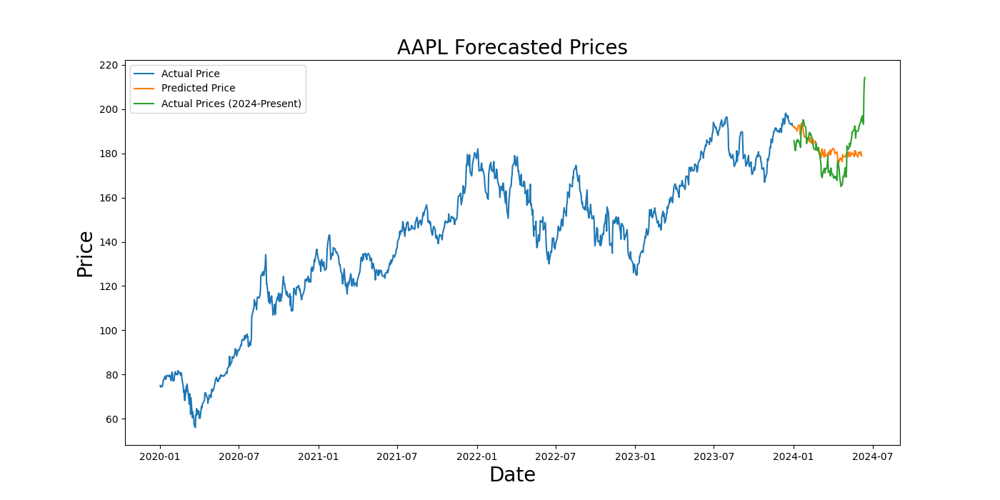
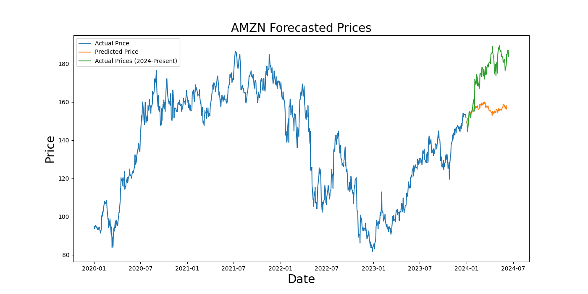
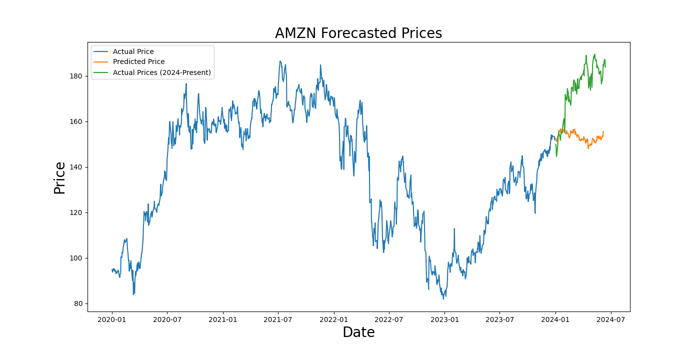
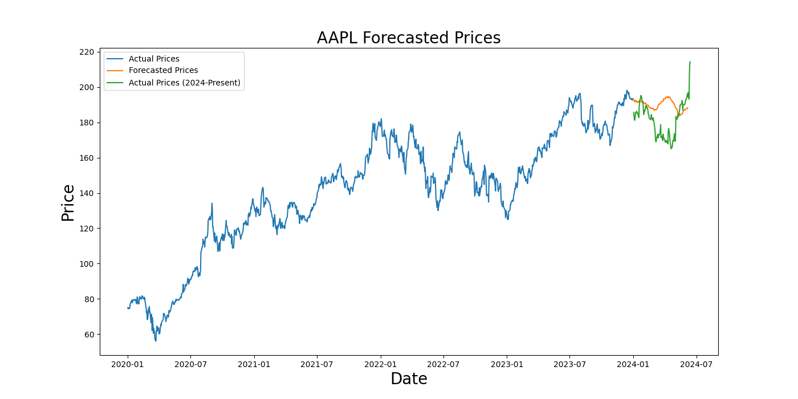
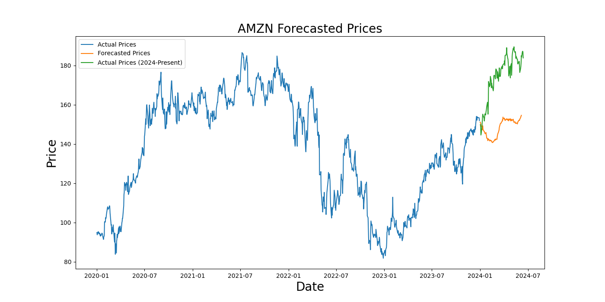

# Transformers-For-Stock-Price-Prediction
This project experiments with the Autoformer by Wu et al. [[paper](https://arxiv.org/pdf/2106.13008)] and Google’s Time Series Foundation Model (TimesFM) [[paper](https://arxiv.org/pdf/2310.10688)] for stock price prediction. 

## Introduction
Forecasting stock prices is an essential part of the finance industry. Instead of using stock indicators and other tactics practiced by human analysts, we use trained time series models to predict a stock's future price. Below we give a brief explanation of each model and present the results.

:triangular_flag_on_post: **Disclaimer:** These models are not foolproof. We strongly discourage basing any financial decisions on these models and disclaim any liability for any negative outcomes resulting from the use of these models

## Models
Each model's performance is evaluated by calculating its mean absolute error (MAE).

## Autoformer
The Autoformer is a type of transformer model, unique for its auto-correlation mechanism.

<b>Figure 1:</b> Overall architecture of Autoformer (Credits: https://arxiv.org/pdf/2106.13008)

## LSTM
The LSTM learns to retain relevant information over long sequences while discarding less important data, which makes it effective for tasks like forecasting. We use it as a benchmark to compare against the transformer models as LSTMs are very common for time series forecasting.

<b>Figure 2:</b> Overall architecture of an LSTM (Credits: https://d2l.ai/chapter_recurrent-modern/lstm.html)

## TimesFM
TimesFM is a type of transformer trained on 100 billion time-series data points and does not require dataset-specific training. This allows one to skip the training process and immediately start forecasting based on the data one feeds it. In this case, we feed it historical stock data.

<b>Figure 3:</b> Overall architecture of TimesFM (Credits: https://arxiv.org/pdf/2310.10688)

## Overall Results: 

## LSTM Plots (100 epochs): 

	

## LSTM Plots (200 epochs): 

	

## TimesFM Plots: 

		
## Thoughts: 
The LSTM achieved promising results  with little to no fine-tuning and TimesFM's were quite good. However, I plan to tinker with the Autoformer in the future as the results were very disappointing.

### References:
Rasul, K., Rogge, N., Simhayev, E. (2023, June 16). Yes, Transformers are Effective for Time Series Forecasting (+ Autoformer). Retrieved May 4, 2024, from https://colab.research.google.com/github/huggingface/notebooks/blob/main/examples/autoformer-transformers-are-effective.ipynb

Linux Fans. (2024, May 20). timesfm. Retrieved June 7, 2024, from https://github.com/lhw828/timesfm

Sharma, P. (2021, August 8). LSTM Models for Time Series Forecasting. Retrieved June 16, 2024, from https://www.kaggle.com/code/pawan2905/lstm-models-for-time-series-forecasting

